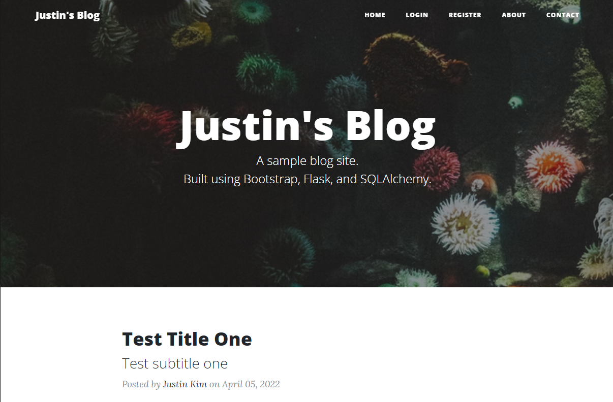
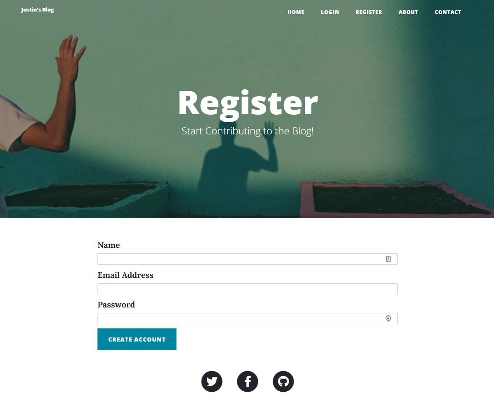
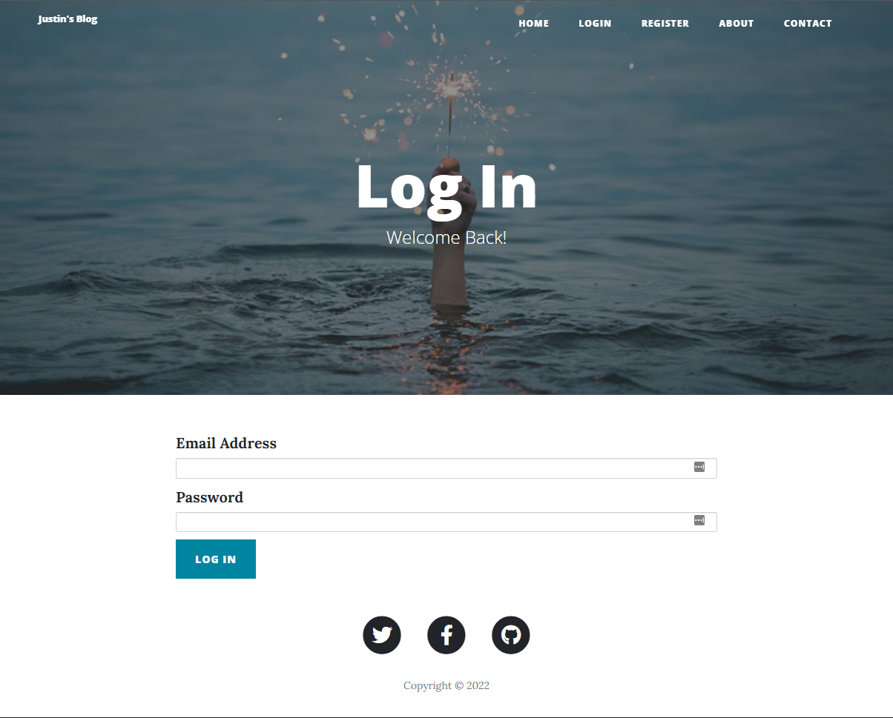
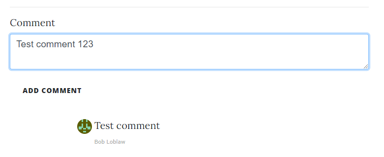

# Personal Blog Site

## Description

A personal blog site that allows an admin to create, update, and delete blog posts. 

Users can register new accounts and login to leave comments on individual blog posts. 

Accounts are stored in an SQL database and passwords are encrypted using Werkzeug

### Built With

- Python
- Flask
- CSS
- HTML
- Bootstrap
- Heroku
- SQLAlchemy

## Usage

### Home Page

### Registration Page

### Login Page

### Leave Comments

## License

This project is licensed under the MIT License - see the LICENSE.txt file for details

## Credit

This site was built off a template found on https://startbootstrap.com/

---

